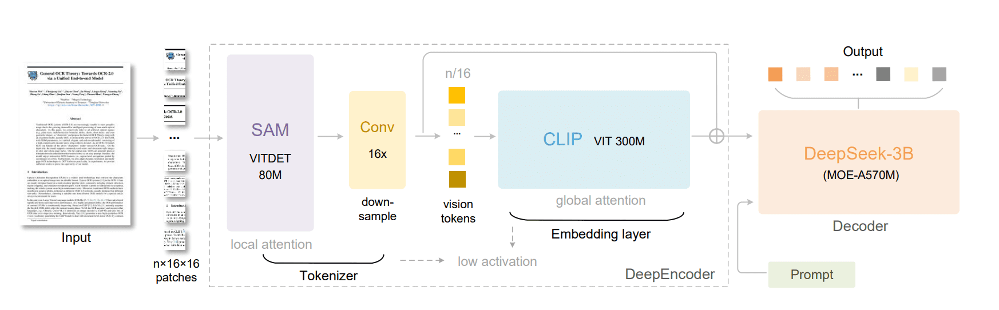
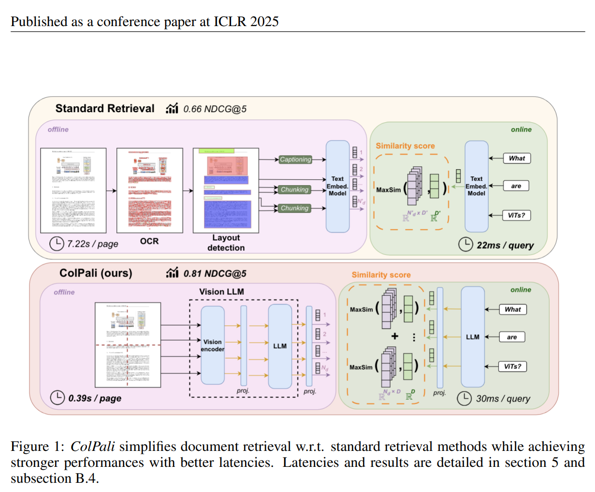

# ColDeepSeekOCR — OCR-Native Document Retrieval with ColBERT-style Late Interaction

> **A ColPali-engine extension** that adapts [DeepSeek-OCR](https://huggingface.co/deepseek-ai/DeepSeek-OCR)
> into a multi-vector document embedding model for retrieval, following the
> [ColBERT / ColPali](https://arxiv.org/abs/2407.01449) late-interaction paradigm.

---

## What Is This?

Standard document retrieval pipelines require brittle OCR → layout detection → text chunking → embedding chains.
**ColPali** (ICLR 2025) showed that a single Vision-Language Model can replace all of that — and beat it.

This repository takes that idea further by swapping in **DeepSeek-OCR** as the VLM backbone:
a 3.3 B-parameter model purpose-built for document understanding with a dual-encoder vision stack (SAM local patches + CLIP global view) and a DeepSeek-V2 MoE language decoder.

We add a single linear projection head (`hidden_size → 128`) on top of the LLM's last hidden states, apply L2 normalisation, and train with the ColBERT MaxSim contrastive loss.  The result is **ColDeepSeekOCR**: per-token multi-vector embeddings that exploit DeepSeek-OCR's rich OCR priors for retrieval.

> **🚧 Fine-tuned weights coming soon.** The code and training pipeline are complete.
> Trained checkpoints will be released on Hugging Face Hub shortly.

---

## Architecture

### DeepSeek-OCR Backbone

<p align="center">
  
</p>

| Component | Details |
|-----------|---------|
| **Local encoder** | SAM ViT-Det 80 M — extracts fine-grained patch features via local attention |
| **Conv downsampler** | 16× stride convolution — reduces spatial tokens before injection |
| **Global encoder** | CLIP ViT-L 300 M — provides layout-aware global context via full attention |
| **Fusion** | Local tokens ⊕ global embedding → unified vision tokens |
| **Language decoder** | DeepSeek-V2 3 B (MoE-A570 M) — 12-layer decoder, use_mla=False |
| **Prompt** | `<image>\nDescribe the image.` (visual prompt, doc side) |

Each document image produces **~699 multi-vector embeddings** after the LLM pass — reflecting the full token sequence (global patches + local tiles + prompt tokens).

### ColPali Late Interaction

<p align="center">
  
</p>

Standard retrieval (top) chains OCR, layout detection, captioning, and chunking — ~7 s/page.
ColPali-style retrieval (bottom) feeds raw page images into a VLM and scores queries against per-token embeddings with MaxSim — **0.39 s/page**, 0.81 NDCG@5 on ViDoRe.

**ColDeepSeekOCR** follows the same pattern:

```
Image  ──► SAM local encoder
        ├─► CLIP global encoder   }  DeepEncoder
        └─► DeepSeek-V2 decoder   ──► last_hidden_state  (batch, seq, 1280)
                                        │
                                   nn.Linear(1280, 128)
                                        │
                                     L2 norm
                                        │
                                   per-token embeddings  (batch, seq, 128)

Query  ──► tokenizer ──► DeepSeek-V2 decoder  ──► same projection ──► query embeddings

Score  ──► MaxSim(query_embs, doc_embs)  ──► retrieval score
```

---

## Setup

### Requirements

```bash
# Python ≥ 3.10, CUDA 11.8+
git clone <this-repo> && cd colpali
pip install -e ".[train]"

# Required for QLoRA fine-tuning
pip install bitsandbytes peft
```

The model's remote code (from `deepseek-ai/DeepSeek-OCR`) is **auto-patched on first import** to work with modern `transformers` versions — no manual edits required.

### Virtual Environment (Recommended)

```bash
python -m venv coldeepseek
source coldeepseek/bin/activate
pip install -e ".[train]"
pip install bitsandbytes peft
```

---

## Quick Start

### Embed document images

```python
import torch
from PIL import Image
from transformers import AutoTokenizer
from colpali_engine.models.deepseek_ocr import ColDeepSeekOCR, ColDeepSeekOCRProcessor

# Load tokenizer (needs trust_remote_code=True to fetch DeepSeek-OCR's tokenizer)
tokenizer = AutoTokenizer.from_pretrained(
    "deepseek-ai/DeepSeek-OCR",
    trust_remote_code=True,
)

# Load model
model = ColDeepSeekOCR.from_pretrained(
    "deepseek-ai/DeepSeek-OCR",
    torch_dtype=torch.bfloat16,
    device_map="cuda:0",
    trust_remote_code=True,
).eval()

processor = ColDeepSeekOCRProcessor(tokenizer=tokenizer)

# Document images
images = [Image.open("page1.png"), Image.open("page2.png")]
queries = [
    "What is the revenue breakdown by region?",
    "Summarise the key findings in section 3.",
]

# Embed documents
doc_inputs  = processor.process_images(images)
doc_inputs  = {k: v.to(model.device) if hasattr(v, "to") else v for k, v in doc_inputs.items()}

# Embed queries
query_inputs = processor.process_texts(queries)
query_inputs = {k: v.to(model.device) for k, v in query_inputs.items()}

with torch.no_grad():
    doc_embeddings   = model(**doc_inputs)    # (2, ~699, 128)
    query_embeddings = model(**query_inputs)  # (2, seq, 128)

# MaxSim scores
scores = processor.score(query_embeddings, doc_embeddings)
print(scores)  # (2, 2) relevance matrix
```

### 4-bit inference (low VRAM)

```python
from transformers import BitsAndBytesConfig

bnb_cfg = BitsAndBytesConfig(
    load_in_4bit=True,
    bnb_4bit_quant_type="nf4",
    bnb_4bit_use_double_quant=True,
    bnb_4bit_compute_dtype=torch.bfloat16,
)

model = ColDeepSeekOCR.from_pretrained(
    "deepseek-ai/DeepSeek-OCR",
    quantization_config=bnb_cfg,
    device_map="auto",
    trust_remote_code=True,
).eval()
```

---

## Fine-tuning

A ready-to-use training script lives at `scripts/train/train_coldeepseekocr.py`.
It streams the [`vidore/colpali_train_set`](https://huggingface.co/datasets/vidore/colpali_train_set) dataset,
caches a subset to disk, and trains with the ColBERT contrastive loss.
Weights & Biases logging is supported via the `WANDB_API_KEY` environment variable.

### Training modes

| Mode | Command flag | Trainable params | Notes |
|------|-------------|-----------------|-------|
| **LoRA** (default) | *(none)* | ~5 M | Adapters on all LLM attention/MLP layers + projection head |
| **QLoRA** | `--load-in-4bit` | ~5 M | Same as LoRA, backbone loaded in NF4 4-bit (~7 GB VRAM) |
| **Head-only** | `--head-only` | 163 968 | Freeze backbone, train only the 1280→128 projection; fast but slow to converge |
| **Full fine-tune** | `--no-lora` | 3.3 B | No LoRA, full fp16/bf16 training |

### Example: QLoRA run on 9 500 samples

```bash
export WANDB_API_KEY="your_key_here"

CUDA_VISIBLE_DEVICES=0 python scripts/train/train_coldeepseekocr.py \
    --epochs 2 \
    --max-train 9500 --max-eval 250 --max-test 250 \
    --batch-size 8 --grad-accum 4 \
    --lr 2e-4 \
    --load-in-4bit \
    --lora-r 32 --lora-alpha 64 --lora-dropout 0.05 \
    --warmup-steps 50 \
    --logging-steps 20 --eval-steps 100 --accuracy-eval-steps 500 \
    --output-dir ./models/coldeepseekocr_qlora
```

### Example: Head-only (projection only, lower LR)

```bash
CUDA_VISIBLE_DEVICES=0 python scripts/train/train_coldeepseekocr.py \
    --head-only \
    --lr 5e-5 --warmup-steps 100 \
    --epochs 3 \
    --batch-size 32 \
    --output-dir ./models/coldeepseekocr_head
```

> **Note on head-only convergence**: the random-init projection starts at loss = log(batch_size).
> With a frozen backbone not trained for retrieval, convergence is slow.
> LoRA or QLoRA mode is strongly recommended for meaningful retrieval quality.

### Key CLI arguments

```
--epochs N             Training epochs (default: 2)
--batch-size N         Per-device batch size (default: 8)
--grad-accum N         Gradient accumulation steps (default: 4)
--lr FLOAT             Learning rate (default: 2e-4)
--warmup-steps N       Linear warmup steps (default: 50)
--max-train N          Training samples to use (default: 9500)
--max-eval N           Validation samples (default: 250)
--max-test N           Test samples (default: 250)
--head-only            Freeze backbone, train projection only
--no-lora              Disable LoRA (full fine-tune)
--load-in-4bit         QLoRA: load backbone in 4-bit NF4
--lora-r N             LoRA rank (default: 32)
--lora-alpha N         LoRA alpha (default: 64)
--lora-dropout FLOAT   LoRA dropout (default: 0.05)
--logging-steps N      Log train loss every N steps
--eval-steps N         Run validation loss every N steps
--accuracy-eval-steps N  Run Recall@1 accuracy every N steps
--output-dir PATH      Checkpoint output directory
```

---

## How It Works

### Image processing pipeline

Each document page goes through a **dual-branch preprocessing** pipeline before entering the model:

1. **Global view** — the full image is padded to `1024×1024` → CLIP ViT-L processes it with global attention → produces layout-aware embeddings
2. **Local tiles** — if the image is larger than `640×640`, it is split into up to 9 crops at `640×640` each (dynamic aspect-ratio tiling) → SAM ViT-Det processes each tile with local attention → fine-grained OCR features
3. **Token sequence** — image tokens are interleaved in `input_ids` at positions `id=128815`, followed by the prompt suffix `\nDescribe the image.`
4. **LLM pass** — all tokens (image + text) flow through the 12-layer DeepSeek-V2 decoder
5. **Projection** — `last_hidden_state` → `nn.Linear(1280, 128)` → L2 norm → per-token embeddings

### Query processing

Queries are tokenized as `BOS + "Query: " + <query text>`, with no image inputs.
The model auto-injects zero-sum dummy image tensors so the image branch is silently skipped,
and only the LLM decoder runs. The same projection head maps query tokens to 128-dim space.

### Retrieval scoring

```
score(q, d) = MaxSim(q, d) = Σ_i  max_j  q_i · d_j
```

Each query token attends to its most similar document token — capturing fine-grained
token-level alignment across the full page.

---

## Repository Structure

```
colpali/
├── colpali_engine/
│   ├── models/
│   │   └── deepseek_ocr/
│   │       ├── __init__.py
│   │       ├── modeling_coldeepseekocr.py      # ColDeepSeekOCR model
│   │       ├── processing_coldeepseekocr.py    # Processor (tokenize / image preprocess)
│   │       └── _patched_modeling_deepseekv2.py # Compatibility patch for modern transformers
│   ├── trainer/
│   │   └── contrastive_trainer.py              # ColBERT contrastive training loop
│   └── loss/
│       └── colbert_loss.py                     # MaxSim loss
├── scripts/
│   └── train/
│       └── train_coldeepseekocr.py             # Fine-tuning entry point
└── assets/
    ├── deepseekocr_architecture.png            # DeepSeek-OCR architecture diagram
    └── colpali_comparison.png                  # ColPali vs standard retrieval comparison
```

---

## Technical Notes

### Compatibility patching

`deepseek-ai/DeepSeek-OCR` ships remote code that imports removed transformers symbols
(`LlamaAttention`, `LlamaFlashAttention2`, `is_flash_attn_2_available`, `is_torch_fx_available`).
On first import, `modeling_coldeepseekocr.py` auto-patches the cached hub files:

- Replaces the broken attention imports with a self-contained `DeepseekMHAAttention` class
- Silences per-forward debug `print()` calls that spam training logs

This is idempotent and requires no manual intervention.

### Non-persistent buffer fix

DeepseekV2's rotary embedding buffers (`inv_freq`, `cos_cached`, `sin_cached`) and
CLIP's `position_ids` are registered as non-persistent buffers — they are not saved in
the checkpoint and must be re-derived after loading. `from_pretrained` handles this automatically.

### QLoRA + custom_text_proj

When loading in 4-bit mode, `bitsandbytes` wraps every `nn.Linear` — including the
randomly-initialised `custom_text_proj` which has no quantised weights in the checkpoint.
`from_pretrained` detects this and replaces the broken `Linear4bit` shell with a fresh
`nn.Linear` in bf16.


